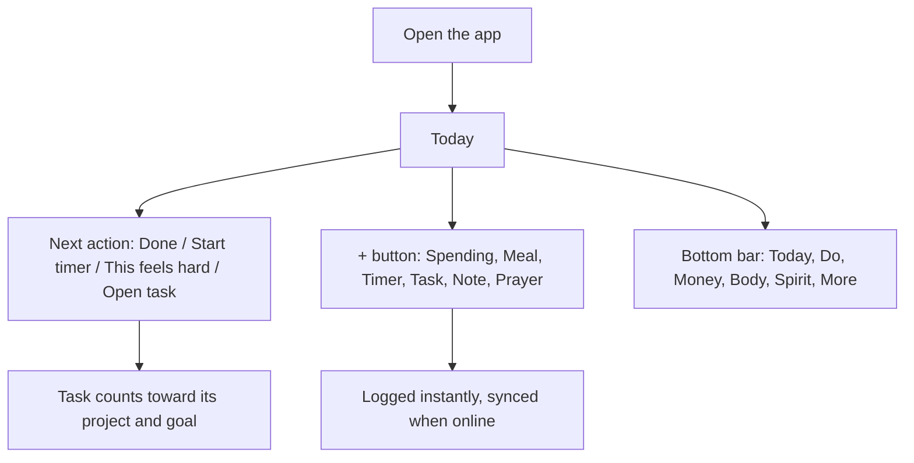

---
tags:
  - overview
  - roadmap
aliases:
  - Current flow and next ideas
updated: 2026-09-22
---

# Current and ideas

> [!info] The original vision
> Life OS started as a real-life RPG operating system. See [[Original plan - Real-life RPG operating system|the original plan]] and [[Original plan vs today|how today compares]].

One page: how Life OS works today, and what could come next. Details live in the linked notes.

---

## Part 1: The current flow

### 1. First visit
1. **Intro page** (`/`): the headline "Your day, money, body and prayers in one calm place", a five-section picker, the principles, and **Get started**. See [[Intro page]].
2. **Sign up or sign in**: Google or email and password (new passwords need 8+ characters). On Android, Google opens in the phone's browser and returns to the app. See [[Workflows/Sign in with Google]].
3. **Setup**: choose which areas you use (everything starts on), your location for prayer times, and optional money details like payday and a safety buffer. Nothing is filled in for you.

### 2. Every day

- **Today** ([[Today]]): greeting, the **one next action**, "Also today", the hub (plain counts, or the character sheet in the RPG skin), at a glance, coming up, today so far. Tabs: Today · [[Week]] · [[Time tracking]].
- **The + button** ([[Quick add]]): log spending, a meal, start a timer, add a task, write a note or mark a prayer, from any page in one or two taps.

### 3. The five sections

| Section | What you do there | Notes |
|---|---|---|
| **Do** | [[Tasks]] (steps, split across days, estimates, timers), [[Projects]] ("x of y tasks", the goals they move), [[Goals]] (linked tasks done, "Moved forward by"), [[Habits]] (sorted by part of life), [[Capabilities]] | |
| **Money** | [[Money]]: left to spend before payday, accounts (some kept separate), transactions with times, recurring costs, categories. [[Resources and electricity]]: meters and balances, Egyptian electricity tiers 1-7, days left on a prepaid balance | Money habits show here |
| **Body** | [[Health]]: medication, weight, sleep, meals, [[Samsung Health]] history and import. [[Food]] | Health habits show here |
| **Spirit** | [[Spirit and prayers]]: the five prayers with times, In jamaah / On time / Late / Missed, a history heatmap, reminders before and at prayer time | Spirit habits show here |
| **More** | [[Notes]] (Keep-style), [[Calendar]], [[Daily review]], [[Settings]], theme, sign out | |

### 4. Always true
- **Only what you logged**: no invented numbers. See [[Product rules]].
- **Works offline**: the last data shows with no signal; changes queue and sync later. Fixed on 22 Sep so it no longer asks you to sign in offline. See [[Offline and sync]].
- **Private**: every row belongs to your account (row-level security). See [[Supabase and security]].
- **Two skins**: Serious (default) or RPG (XP, levels, prayer streak, "+XP" when you log). See [[Skins - Serious and RPG]].
- **Two themes**: light and dark. The app rotates with the phone.

### 5. How it's built and shipped
Code on the `at-a-glance` branch → checks (type-check, 107 unit tests, 22 Playwright tests, build) → fast-forward to `main` → Vercel deploys [lifeos0.vercel.app](https://lifeos0.vercel.app) → `npm run build:android` → APK sent to the phone. See [[Workflows/Release web and Android]].

### 6. Known pain points (from your screenshots)
- **Pages are long and feel overwhelming**, far from the calm look of the ad. Health is the longest.
- Notes don't sync with Google Keep, which has no way for other apps to connect on personal accounts.
- Fixed on 22 Sep, waiting to ship: offline sign-in, the prepaid meter at a glance, the meter's daily rate, and the note editor jumping.

---

## Part 2: Next ideas

Full list with sizes: [[Ideas backlog]]. Recommended order, for the most daily value per unit of effort:

### Now: make it feel like the ad
1. **One screen per tab**: each tab shows today's essentials and one main action; the rest goes under "Details", closed by default and remembered.
2. **Due date and time** on tasks, and **duplicate a task**.
3. **Notes backup**: download and restore your notes as a file (Markdown and JSON). Google Drive backup can follow.

### Next: plans and study
4. **Pre-made plans**: "Get fit in 30 days", "Learn German in 60 days". A plan creates a project with tasks spread over the days.
5. **Study mode**: courses, assignments, exams and deadlines, course milestones and progress, and importing your uni timetable (calendar file).
6. **Mini-task timers**: start and end times, a Pomodoro, and a guided "turn this task into steps".

### Then: insight
7. **History analytics** across all areas, with an **Excel export**.
8. **Relations between past events** (for example sleep against tasks done), always with sample sizes.
9. **Habit forecasts** that show their workings ("done 5 of the last 7 Mondays").
10. **Helpful AI**, starting with "break this task into steps" and "build me a plan", which only needs the text you type.

### Later: phone, people and reach
- **Phone**: water alarm (repeating reminders), voice to text, focus lock while doing a task, OCR (use case to decide).
- **Look**: Arabic with right-to-left layout, accent colour choice, a wide multi-column dashboard for tablets and foldables, optional personality-type presets.
- **Calendar**: national holidays per country (opt in, reject any day).
- **Life areas**: car maintenance and fuel, sleep score, BMI, notes more like Obsidian.
- **Rewards**: your own rewards unlocked by goals or levels.
- **People**: friends, shared tasks, doing a task together at the same time. This is the biggest change, because data stops being private-only.
- **Integrations**: Alexa, and other apps (to define).

### Open decisions
From the grilling session, still waiting on you:
- Ship the 22 Sep fixes now?
- Is "one screen per tab" the right fix for long pages?
- Stay private, or add friends and sharing?
- What may the AI see?
- Your top five.
- Definitions for: "set standards for the app", "access other apps", "Google Flow", "a Word doc of every AI message", and what OCR is for.

Related: [[Home]] · [[Roadmap and known issues]] · [[Ideas backlog]]
